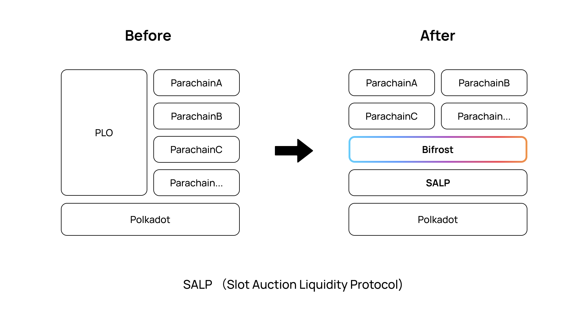
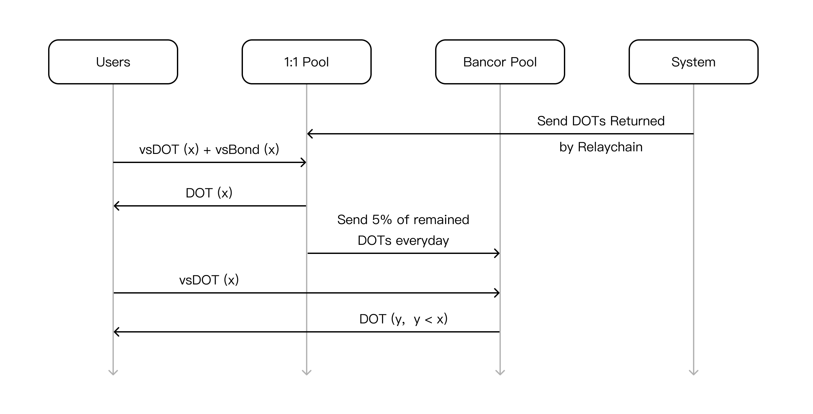

# Slot Auction 衍生品

## PLO 概述

Polkadot采取了中继链与平行链协同工作的设计方案。多个平行链共享同一个中继链提供的共识安全性。中继链能够支撑的平行链数量是有限的，某个平行链能够接入中间链运行，则必先拥有中继链的卡槽（Slot），因此Polkadot设计了PLO卡槽竞拍机制。 简单来说，平行链项目竞拍卡槽，需抵押较高额度的中继链代币（DOT/KSM），这些资金或来自于平行链项目方自身的投资，或项目方从社区中通过众筹活动募集而来。项目方通常会承诺给予社区投资者一定额度的投资回报，比如平行链自身发行的代币（ Parachain Token ）。Slot竞拍规则的具体细节，可参考：[https://wiki.polkadot.network/docs/en/learn-auction](https://wiki.polkadot.network/docs/en/learn-auction)

## 释放流动性

在为Staking机制提供流动性的同时，Bifrost也为那些与 Staking 资产质押机制具备较高相似度的经济模型提供流动性释放能力，为更多的DeFi生态应用场景贡献力量。PLO（Parachain Lease Offering）是 Polkadot 生态的关键经济模型之一，与 NPoS 的 Staking 机制有较高的可比性与相似度，是 Bifrost 优先考虑实现的业务之一。投资者直接进行 PLO 与通过 Bifrost 进行 PLO 的流程对比如下：

## 技术实现方案

从系统设计的顶层视图看，投资者用户通过Bifrost参与平行链项目的PLO众筹活动，Contribute行为会分离解耦出两类Token资产：vsToken（vsDOT/vsKSM）与vsBond。投资者贡献x个DOTs/KSMs，可获得x个vsDOTs/vsKSMs与x个vsBond。vsToken与vsBond持有者与Bifrost的交互时序图如下：

### vsBond
vsBond 代表具体的平行链及其竞拍成功的 Lease Period 。所以 vsBond 的全名为：vsBond + 平行链名称 + Slot 租约到期日，比如：vsBond-Bifrost-2022-06-01。
vsBond 拥有两个主要属性：
1.平行链竞拍成功奖励：在 Bifrost 链上铸造出 vsBond 的地址 （而非交易获得），将被 SALP 记入 Contributor 名单，名单中所有地址将在平行链竞拍成功后获得由项目方发放的众贷奖励。
2.与 vsToken 结合可在平行链租期到期后进行 1:1 赎回。因此，vsBond 作为权益凭证，并不需要高流动性交易，可通过一口价形式挂单出售，因此 Bifrost 系统设计有挂单售卖vsBond 的机制，类似于 NFT 买卖市场，无需创建流动性池。

### vs**Token**

和vsBond不同，所有的vsToken都是同质的，vsToken不与特定的平行链及Slot绑定。Bifrost设计了两个兑换池子：1:1承兑池、Bancor池（1:x, x &lt; 1）。具体的兑换规则如下： 1、用户同时持有vsBond-ID和vsToken，且vsBond-ID所代表的Slot租约已到期，则可参与承兑池以1:1的价格兑换出Token; 2、若用户只有vsToken，则可参与Bancor池，以1:x（x &lt; 1）的价格兑换出Token（Bancor池子中存放有Token时，用户才可正常执行兑换功能）。 3、当Slot租约到期时，Relaychain将返还Token到Bifrost，系统会将所有的Token放入1:1承兑池，然后每天从1:1承兑池的余额中抽取5%放入Bancor池。 4、若系统丢失vsBond或者某些攻击者故意囤聚vsBond而不愿意卖出，vsToken持有者仍然可以从Bancor池中兑换出Token，而不用担心vsToken不能兑付的风险。 5、系统注入到Bancor池的资金，会以线性平滑的机制逐渐释放,而不是一次性全部释放，防止vsToken与Token兑换价格不合理地大幅度波动。相当于系统在用一部分Token持续购买用户持有的vsToken。 6、只要在Bancor池中发生1:x（x &lt; 1）的兑换行为，系统（Bifrost）必然会盈利，这部分利润将进入国库,用于社区发展或回购BNC。

**Bancor算法**

为了避免计算过程中出现除数为0的情况，系统可对Balance与Supply设置初始的虚拟基值BaseBalance与BaseSupply，用户进行兑换时，将具体数额带入公式进行计算，并将所得结果减去初始基值，即可获得最终结果。如下图所示：初始的DOT虚拟基值为BaseSupply，vsDOT与DOT的价格比例为1:1；当有3\*BaseSupply（4\*BaseSupply - 1\*BaseSupply）的DOT从Bancor池中兑换掉时，vsDOT与DOT的价格比例达到2:1。系统实现时，可选取合适的BaseSupply值，以获得合适的价格曲线。

