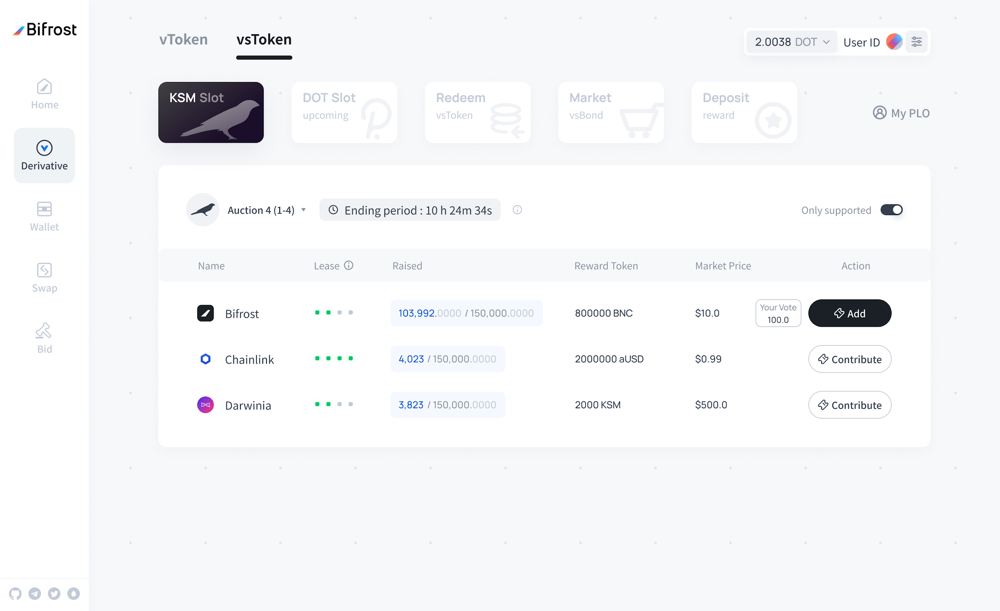
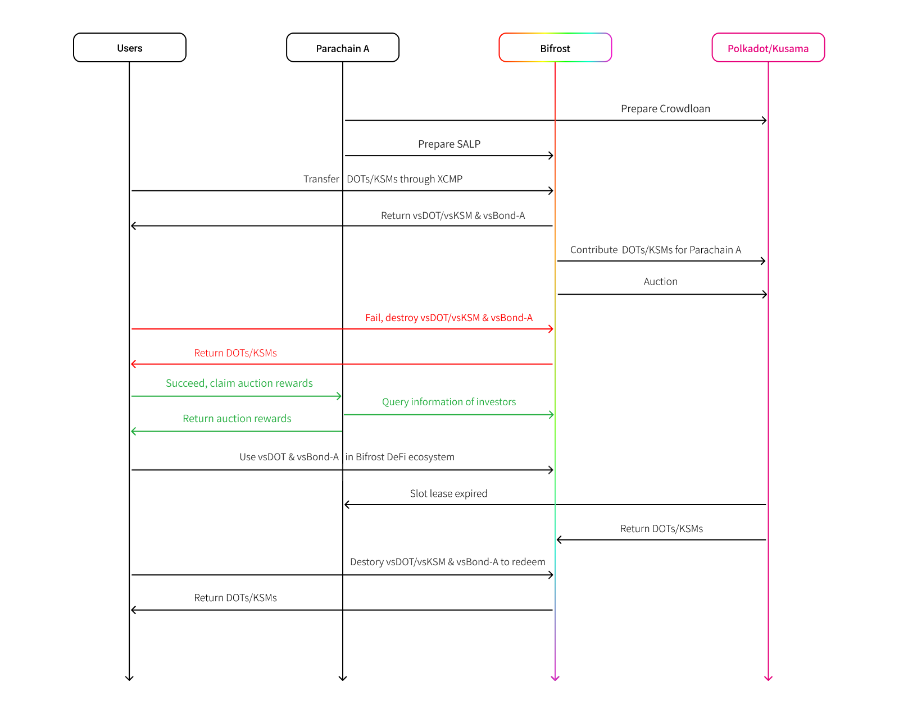
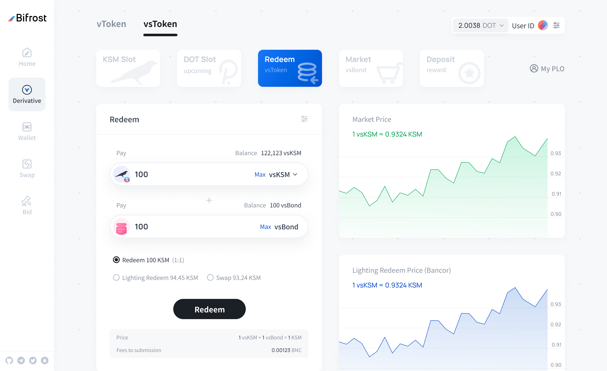
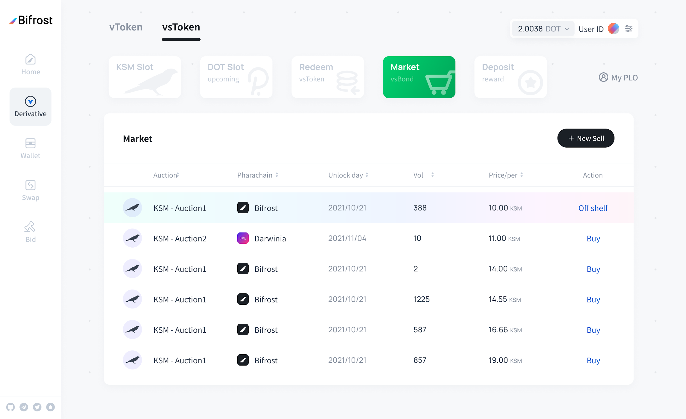
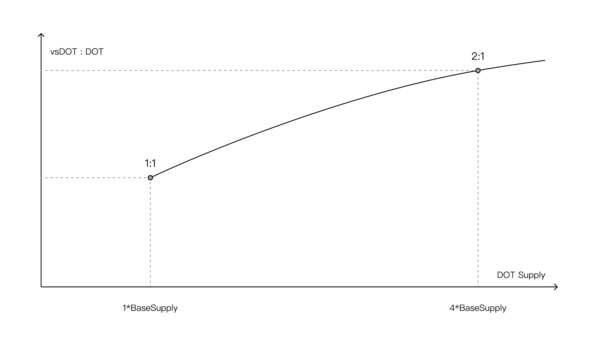

# Slot Auction Derivative

## Description

**Bifrost SALP \(Slot Auction Liquidity Protocol\) aims to release liquidity of contributions in Kusama/Polkadot crownloan through the issuance of derivatives.** This will greatly increase asset utilization and attract more prudent investors who do not want to lose opportunity costs to support the parachain slot auction, thereby accumulating more DOT/KSM lock-ups for the Polkadot/Kusama ecosystem.

Bifrost has designed two derivatives for users: vsToken \(voucher slot token\) and vsBond. The former is a fungible token, which represents a voucher of a user's contribution to a parachain auction. The voucher can be traded at any time or cooperated with vsBond for 1-to-1 peg redemption.

The latter is a token represents the auction reward and lease period of different parachains, which smooths out the problem of different reward strategies between parachains. Meantime, vsBond can execute transactions through Bifrost's built-in vsBond market, without having to consider liquidity issues.

Bifrost hopes to distinguish between a Token’s utility value and its equity in the simplest way through vsToken and vsBond. At the same time, vsToken will have strong liquidity as a contribution derivative.

**UI:Participate in the Crowdloan page in Bifrost**

Through SALP, it may benefit the following three roles in Polkadot ecosystem: User: Derivatives enhance the user's control over opportunity costs, while the vsToken/vsBond helps contributors to determine the utility and equity of derivatives. Moreover, the high liquidity from integrating all parachain contributions may reduce the high discount costs by a separated single-parachain derivative pool. Parachain projects: Projects that support the Bifrost SALP will have the advantage of attracting contribution, and will be more competitive in the parachain auction. In addition, the fierce competitive environment will promote the accelerated innovation of parachain projects. Polkadot ecosystem: According to the concept of "flexible lock-up" of liquidity derivatives, more contributors willing to participate in Crowdloan through centralized services will be attracted to on-chain, weakening the controlling ratio of DOT/KSM by centralized institutions, makes parachain auction more decentralized. In addition, a high-locked asset ratio can promote the security of PoS chain, and derivatives will eliminate the negative effect of low circulating.

## Solutions

Contributor conducting SALP through Bifrost is as follows:

1. Original Crowdloan Workflow

2 Bifrost SALP Workflow

Investor users participating in crowdloan through Bifrost will separate and decouple two types of Token assets: vsToken and vsBond.

### vsBond: a token represents parachain auction reward and vsToken 1:1 redemption

vsBond represents the specific parachain and its successful Lease Period. Therefore, the full name of vsBond is: vsBond+Parachain Project Name+Retirement Date, for example: vsBond-Bifrost-2022-06-01.

vsBond has two main attributes: Contribution Reward: vsBond can be transferred to the corresponding parachain through XCMP, and then only the address holding vsBond needs to be identified as a contributor. Combined with vsToken, vsToken can be redeemed 1:1 after slots retirement. Therefore, vsBond can be regarded as a special product that contains Contribution Reward and 1:1 redemption. As an equity certificate, vsBond does not require high-liquidity transactions and can be sold through a buy-in-price form of pending orders in Bifrost vsBond market, without creating liquidity pools.

**UI:vsBond+vsToken 1:1 redemption interface**

**UI:vsBond market**

### vsToken: a fungible token that releases contribution liquidity

The function of vsToken enables contributors to sell the vsToken in exchange for the original Token before slots retirement, so as to achieve the purpose of releasing liquidity. Unlike vsBond, vsToken is not tied to specific parachains and Slots. To this end, Bifrost designed two exchange pools to achieve the fungible of vsToken: 1-to-1 peg pool and Bancor pool \(1: x, x &lt;= 1\). The specific exchange rules are as follows:

1. If the user holds both vsBond and vsToken, and the parachain represented by vsBond has expired, they can participate in 1-to-1 peg pool and redeem Token at a price of 1:1.
2. If the user only has vsToken, he can participate in the Bancor pool and redeem the Token at a price of 1:x \(x &lt;= 1\) \(the user can only perform the redemption function normally when Bancor pool has remaining Token, or wait until No.3\).
3. When the parachain retires, Relaychain will return the tokens to Bifrost, and the system will put all tokens into 1-to-1 peg pool, and draw 5% of balance of 1-to-1 peg pool into the Bancor pool every day.
4. The funds injected into the Bancor pool by the system will be gradually released in a linear and smooth mechanism, rather than all at once, to prevent unreasonable and large fluctuations in the exchange price of vsToken and Token. It is equivalent to the system using part of the token to continuously purchase vsToken held by the user.
5. The acceptance period of vsBond is 3 months to prevent some attackers from deliberately hoarding vsBond and unwilling to sell. If vsBond is lost, vsToken can still be used to redeem Tokens from the Bancor pool without worrying about the risk that vsToken cannot be redeemed.
6. As long as the exchange behavior of 1:x \(x &lt;= 1\) occurs in the Bancor pool, the system \(Bifrost\) will inevitably make a profit, and this part of the profit will go to the treasury for community development or repurchase of BNC.

## Bancor Algorithm

In order to avoid the situation where the divisor is 0 during the calculation process, the system can set the initial virtual base values \(BaseBalance and BaseSupply\) for Balance and Supply. When the user exchanges Tokens, the specific amount is brought into the formula for calculation, and the result is subtracted from the initial base value, then you can get the final result. As shown in the figure below: the initial virtual base value of DOT is BaseSupply, and the price ratio of vsDOT to DOT is 1:1; when 3\_BaseSupply \(4\_BaseSupply-1\*BaseSupply\) DOT is redeemed from the Bancor pool, The price ratio of vsDOT to DOT reaches 2:1. When the system is implemented, a suitable BaseSupply value can be selected to obtain a suitable price curve.

